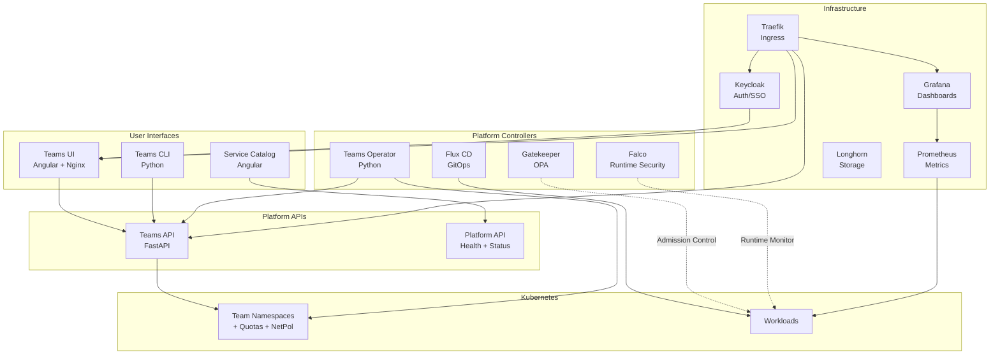

# PRD-010: Documentation & Runbook Integration

## Metadata

| Field | Value |
|-------|-------|
| **PRD ID** | PRD-010 |
| **Title** | Documentation & Runbook Integration |
| **Priority** | P1 — High |
| **Effort Estimate** | Small–Medium (3–5 days) |
| **Dependencies** | All other PRDs (documentation covers the full platform) |
| **Status** | Draft |

---

## 1. Problem Statement

The repository has individual README files for each component (Teams API, CLI, UI, Operator) and a top-level README with a task checklist. However, there is no guided demo script, no architecture diagram, no operational runbook, and no single document that ties the platform story together.

The existing README.md TODO item — "do a runthrough with these updated docs" — acknowledges this gap. For a platform engineering demo to be effective, the presenter needs a structured script, the audience needs visual aids (architecture diagrams), and operators need runbooks for common tasks.

## 2. Goals

- **G1**: A comprehensive architecture diagram showing all platform components and their interactions.
- **G2**: A guided demo script with exact commands, expected outputs, and narrator notes for a 30–45 minute live demo.
- **G3**: Operational runbooks for common platform tasks (adding a team, rotating secrets, debugging a failed deployment, responding to a Falco alert).
- **G4**: A platform overview document that tells the "why" behind each component and how they relate to platform engineering principles.

## 3. Non-Goals

- TechDocs hosting infrastructure (e.g., Backstage TechDocs, MkDocs deployment).
- API reference documentation beyond what Swagger/FastAPI auto-generates.
- User-facing help documentation for the Teams UI.
- Training curriculum or workshop exercises (the existing module READMEs cover this).

## 4. Scope

### 4.1 Architecture Diagram

A Mermaid-format diagram (renderable in GitHub, documentation sites, and as SVG):



Also create a simplified version as a standalone SVG for presentations.

### 4.2 Guided Demo Script

`docs/DEMO-SCRIPT.md` — A structured, time-boxed script:

#### Demo Structure (30–45 minutes)

**Part 1 — Platform Overview (5 min)**
- Show the architecture diagram.
- Explain the platform engineering philosophy: "We're building a product for developers."
- Hit `/platform/health` and `/platform/capabilities` to show the platform is alive and what it offers.

**Part 2 — Self-Service Team Provisioning (8 min)**
- Create a team via the UI or CLI.
- Show the namespace appear with quotas, network policies, and RBAC.
- Scaffold a workload. Show the generated manifests.
- Deploy the workload. It passes all Gatekeeper checks.

**Part 3 — Compliance at the Point of Change (8 min)**
- Run the policy violation demo (PRD-005).
- Show root container blocked, CVE violation caught, low coverage rejected.
- Deploy the corrected versions. They succeed.
- "The platform enforces the rules so humans don't have to."

**Part 4 — Observability (5 min)**
- Open the Grafana Teams API dashboard.
- Create/delete some teams. Watch metrics update in real-time.
- Show the auto-provisioned dashboard — "Zero configuration."

**Part 5 — Runtime Security (5 min)**
- Show Falco running. Explain the custom rules.
- Show the root container detection rule.
- If possible, exec into a container and trigger a Falco alert.

**Part 6 — GitOps & CI/CD (5 min)**
- Show the Flux sync status.
- Show the GitHub Actions pipeline.
- Explain the full loop: code → image → manifest → deploy.
- Show SOPS-encrypted secrets in the repo.

**Part 7 — Wrap-up (4 min)**
- Return to `/platform/health`. "Everything is green."
- Show the service catalog. "Everything is discoverable."
- Closing: "This is what platform engineering looks like. A product that makes developers productive, safe, and fast."

#### Script Format

Each section includes:

```markdown
### Section: [Title]
**Duration**: X minutes
**Setup required**: (any pre-demo preparation)

#### Narrator Notes
What to say and emphasize.

#### Commands
```bash
# Exact commands to run
```

#### Expected Output
What the audience should see.

#### Transition
How to move to the next section.
```

### 4.3 Operational Runbooks

`docs/runbooks/` directory with task-oriented documents:

#### Runbook List

| Runbook | Filename | Audience |
|---------|----------|----------|
| Adding a New Team | `adding-a-team.md` | Platform Operator |
| Rotating SOPS/Age Keys | `rotating-sops-keys.md` | Platform Operator |
| Debugging a Failed Flux Sync | `debugging-flux-sync.md` | Platform Operator |
| Responding to a Falco Alert | `responding-to-falco-alerts.md` | Security/Platform Operator |
| Adding a New Gatekeeper Policy | `adding-gatekeeper-policy.md` | Platform Operator |
| Updating Container Images | `updating-container-images.md` | Developer |
| Requesting Cross-Namespace Access | `requesting-network-access.md` | Developer |
| Checking Platform Health | `checking-platform-health.md` | Developer/Operator |
| Recovering from a CrashLoopBackOff | `recovering-crashloop.md` | Developer |
| Scaling a Team's Resource Quota | `scaling-team-quota.md` | Platform Operator |

#### Runbook Template

Each runbook follows a consistent format:

```markdown
# Runbook: [Title]

## When to Use
Trigger conditions / symptoms.

## Prerequisites
Tools, access, permissions needed.

## Steps
1. Step one with exact commands.
2. Step two with expected output.
3. ...

## Verification
How to confirm the task succeeded.

## Troubleshooting
Common issues and fixes.

## Rollback
How to undo if something goes wrong.
```

### 4.4 Platform Overview Document

`docs/PLATFORM-OVERVIEW.md` — A narrative document explaining:

- What this platform is and who it's for
- Platform engineering principles demonstrated (self-service, golden paths, guardrails, observability, GitOps)
- Component map: what each tool does and why it was chosen
- How components interact (data flows, event chains)
- What the platform provides vs what developers are responsible for
- Comparison to the alternative: "Without a platform, developers would need to..."

### 4.5 Dependency / Implementation Order Guide

`docs/IMPLEMENTATION-ORDER.md` — A guide for anyone building this platform from scratch:

```markdown
## Recommended Implementation Order

### Phase 1 — Foundation
1. Kubernetes cluster (AKS/EKS/GKE or local)
2. Flux CD bootstrap
3. Traefik ingress controller
4. Longhorn storage

### Phase 2 — Security & Compliance
5. Gatekeeper + constraint templates + policies
6. Falco + custom rules
7. SOPS/Age secrets management

### Phase 3 — Platform Services
8. Keycloak (auth)
9. kube-prometheus-stack (monitoring)
10. Teams API + UI + CLI

### Phase 4 — Automation
11. Teams Operator
12. CI/CD pipeline (GitHub Actions)
13. Namespace enrichment (quotas, network policies)

### Phase 5 — Platform Maturity
14. Service catalog
15. Platform health API
16. Cost visibility
17. Documentation & runbooks
```

## 5. Technical Design

### 5.1 Directory Structure

```
docs/
├── PLATFORM-OVERVIEW.md
├── ARCHITECTURE.md              # Contains Mermaid diagram + component descriptions
├── ARCHITECTURE.svg             # Rendered diagram for presentations
├── DEMO-SCRIPT.md               # Guided demo with commands and narrator notes
├── IMPLEMENTATION-ORDER.md      # Build order guide
├── runbooks/
│   ├── adding-a-team.md
│   ├── rotating-sops-keys.md
│   ├── debugging-flux-sync.md
│   ├── responding-to-falco-alerts.md
│   ├── adding-gatekeeper-policy.md
│   ├── updating-container-images.md
│   ├── requesting-network-access.md
│   ├── checking-platform-health.md
│   ├── recovering-crashloop.md
│   └── scaling-team-quota.md
└── diagrams/
    ├── architecture.mermaid
    ├── gitops-flow.mermaid
    ├── policy-enforcement-flow.mermaid
    └── team-provisioning-flow.mermaid
```

### 5.2 Diagram Rendering

Mermaid diagrams are stored as `.mermaid` files and rendered:

- Inline in GitHub (GitHub renders Mermaid in markdown).
- As SVGs using `mmdc` (Mermaid CLI) for offline use and presentations.
- In the platform UI if PRD-002 (service catalog) includes a platform architecture view.

### 5.3 README.md Update

The top-level `README.md` is updated to:

- Replace the task-list format with a narrative introduction.
- Link to the architecture diagram and platform overview.
- Link to the demo script for presenters.
- Link to runbooks for operators.
- Retain the quick-start commands for AKS credentials and Flux bootstrap.

## 6. Demo Script (Meta)

This PRD's "demo" is the demo script itself. The success of this PRD is measured by whether a presenter who has never seen the platform before can follow the demo script and deliver a compelling 30-minute demo.

## 7. Success Criteria

- [ ] Architecture diagram accurately represents all deployed components and their interactions.
- [ ] Demo script covers all major platform capabilities in a structured 30–45 minute flow.
- [ ] Demo script includes exact commands, expected outputs, and narrator talking points.
- [ ] At least 10 operational runbooks are written covering the most common platform tasks.
- [ ] Platform overview document explains the "why" behind each component.
- [ ] Implementation order guide provides a clear build sequence.
- [ ] All documentation is accessible from the top-level README.md.
- [ ] A new presenter can follow the demo script and deliver the demo without prior knowledge.

## 8. Risks & Mitigations

| Risk | Likelihood | Impact | Mitigation |
|------|-----------|--------|------------|
| Documentation becomes stale as platform evolves | High | Medium | Include documentation updates in PR checklists; add a "last verified" date to each runbook |
| Demo script commands break with version updates | Medium | High | Pin versions in demo commands; test demo script before each presentation |
| Architecture diagram too complex for audience | Medium | Medium | Create both detailed and simplified versions; use the simplified version in the opening |
| Runbooks too verbose for quick reference | Low | Low | Use consistent template with clear step numbering; add TL;DR at the top of each |

## 9. Future Considerations

- MkDocs or Docusaurus deployment for a hosted documentation site.
- Backstage TechDocs integration for in-platform documentation.
- Video recordings of the demo for async consumption.
- Interactive demo environment (Killercoda/Instruqt scenario) for hands-on audience participation.
- Automated documentation testing (verify commands in runbooks still work via CI).
- Changelog automation: generate a "what's new" document from Git history.
